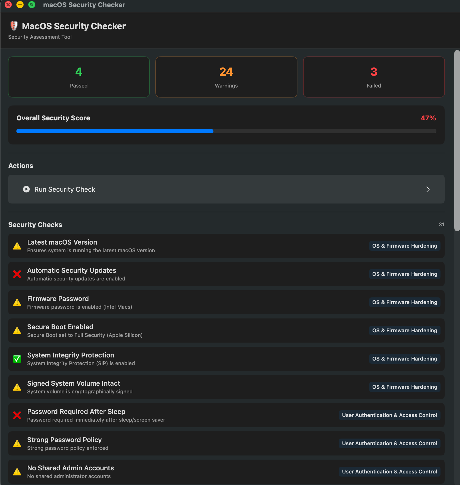
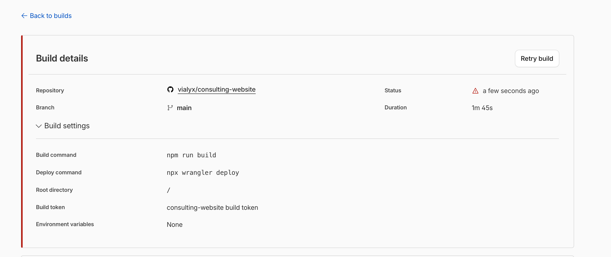

# macOS Security Checker

A comprehensive macOS security assessment application that runs in the menu bar and provides real-time security posture visibility.

## 💝 Support This Project

If you find this tool helpful, consider supporting its development:

[](https://www.paypal.com/paypalme/vialyx)

**PayPal**: [Donate Here](https://www.paypal.com/paypalme/vialyx)

Your support helps fund ongoing development, security improvements, and new features!

## Features

### 🛡️ 11 Security Categories

1. **OS & Firmware Hardening** - Latest macOS, Secure Boot, SIP, firmware password
2. **User Authentication & Access Control** - Password policies, Touch ID, account management
3. **Disk & Data Protection** - FileVault, encryption, Keychain security
4. **Application Security & Execution** - Gatekeeper, XProtect, MRT, App Sandbox
5. **Permissions & Privacy (TCC)** - Full Disk Access, camera/microphone, system-wide permissions
6. **Network Security** - Firewall, DNS, VPN enforcement, Bluetooth
7. **Malware & Threat Protection** - XProtect signatures, persistence monitoring
8. **System Integrity & Tamper Protection** - SIP status, MDM profiles
9. **Logging, Monitoring & Auditing** - Unified logging, audit trails
10. **Compliance & Posture Assessment** - Security scoring, compliance benchmarks
11. **User Education & UX** - Clear remediation guidance, one-click fixes

### 🎯 Key Capabilities

- ✅ Menu bar tray application for macOS
- ✅ Real-time security status monitoring
- ✅ 50+ individual security checks
- ✅ Color-coded status indicators (Pass, Warning, Fail)
- ✅ Remediation guidance for each finding
- ✅ Security score calculation
- ✅ Compliance report generation
- ✅ One-click remediation for common issues
- ✅ Audit trail and logging
- ✅ MDM integration support

## 📸 Screenshots

### Main Dashboard
The application displays a comprehensive security assessment with:
- **Status Cards** - Quick overview of passed, warning, and failed checks
- **Security Score** - Overall security posture (0-100%)
- **Action Buttons** - Easy-to-use controls for running scans
- **Security Checks List** - All 50+ checks with status and remediation info



### Real-time Scanning
Watch the application scan your system in real-time:
- Live progress indicator during scans
- Results update as each check completes
- Visual feedback with icons and color coding


### Detailed Results
Complete security check results with:
- Individual check status for all 50+ checks
- Category tags (OS Hardening, Authentication, etc.)
- Description of each security check
- Remediation guidance for failed items



## Installation & Build

### 📦 Quick Install (Recommended)

**Via .pkg Installer:**
```bash
# The easiest way to install!
open dist/macOS-security-checker-1.0.0.pkg
```

Or rebuild the installer:
```bash
./build_pkg_installer.sh
open dist/macOS-security-checker-1.0.0.pkg
```

See [INSTALLER_README.md](INSTALLER_README.md) for detailed installation options.

### Prerequisites
- macOS 12.0 or later
- Xcode 14.0 or later (for building from source)
- Swift 5.9+

### Build from Source

```bash
git clone https://github.com/yourusername/macOS-security-checker.git
cd macOS-security-checker

# Build using Swift Package Manager
swift build -c release

# Or build with Xcode
xcode-project setup
```

### Run as Menu Bar App

```bash
# Run the executable
./.build/release/macOS-security-checker

# Or run with Xcode
open macOS-security-checker.xcodeproj
```

## Usage

### Starting the Application
1. Launch the app - it will appear in the menu bar
2. Click the shield icon to open the security dashboard
3. Click "Run Checks" to perform a full security assessment

### Menu Bar Interface
- **Shield Icon** - Security status indicator (color-coded)
- **Counts** - Shows pass/warning/fail summary
- **Categories** - Expandable security categories
- **Refresh Button** - Manually trigger security checks

### Dashboard Features
- View security score (0-100%)
- See status of each security check
- Expand categories to see individual checks
- Hover over checks for remediation guidance
- Export compliance reports

## Security Checks Overview

### OS & Firmware (6 checks)
```
✅ Latest macOS version
✅ Automatic security updates
✅ Firmware password (Intel)
✅ Secure Boot Full Security (Apple Silicon)
✅ System Integrity Protection enabled
✅ Signed system volume intact
```

### User Authentication (5 checks)
```
✅ Password required after sleep
✅ Strong password policy
✅ No shared admin accounts
✅ Guest account disabled
✅ Touch ID enabled
```

### Disk Protection (3 checks)
```
✅ FileVault enabled
✅ Recovery key escrowed
✅ External drives encrypted
```

### Application Security (4 checks)
```
✅ Gatekeeper enabled
✅ Notarized apps only
✅ XProtect enabled
✅ MRT enabled
```

### Privacy & Permissions (3 checks)
```
✅ Least privilege enforced
✅ Full Disk Access monitored
✅ Camera & Microphone protected
```

### Network Security (4 checks)
```
✅ Firewall enabled
✅ Stealth mode enabled
✅ Bluetooth restricted
✅ DNS security configured
```

### Threat Protection (2 checks)
```
✅ XProtect signatures current
✅ Persistence mechanisms monitored
```

### System Integrity (2 checks)
```
✅ System volume integrity
✅ MDM profile protected
```

### Logging & Auditing (2 checks)
```
✅ Unified logging enabled
✅ Audit subsystem enabled
```

## API & Technical Details

### macOS APIs Used

- **System Controls**
  - `csrutil` - System Integrity Protection
  - `fdesetup` - FileVault management
  - `spctl` - Gatekeeper and app assessment
  - `system_profiler` - System information
  - `defaults` - User preferences
  - `dscl` - Directory Services

- **Framework APIs**
  - EndpointSecurity (ESF) - Process and file monitoring
  - LocalAuthentication - Biometric checks
  - Network Extension - Network monitoring
  - TCC - Permission tracking
  - MDM - Mobile Device Management
  - Unified Logging - Event logging

### Elevation Requirements

Some checks require elevated privileges:
- FileVault status
- Firmware password
- Audit configuration
- System-wide network settings

The app will prompt for sudo when necessary.

## Configuration

### Preferences
Located in `~/.security-checker/config.json`:

```json
{
  "scanInterval": 3600,
  "alertOnChanges": true,
  "remediationLevel": "guided",
  "complianceBenchmark": "CIS",
  "mdmEnabled": false
}
```

### MDM Integration

To integrate with MDM:
1. Deploy custom MDM profile with security preferences
2. Enable `mdmEnabled` in configuration
3. App will sync settings with MDM
4. Enforcement level automatically adjusted

## Compliance Benchmarks

Supported compliance frameworks:
- **CIS macOS Benchmark** - Center for Internet Security
- **NIST 800-53** - Federal information systems security
- **NIST 800-171** - Controlled unclassified information
- **SOC 2 Type II** - Service organization controls
- **Zero Trust Model** - Continuous verification

## Project Structure

```
macOS-security-checker/
├── Sources/
│   ├── Models/
│   │   └── SecurityCheck.swift       # Data models and enums
│   ├── Services/
│   │   ├── SystemCommandExecutor.swift
│   │   ├── SecurityCheckManager.swift
│   │   └── PrivacyService.swift      # TCC database access
│   ├── Checks/
│   │   ├── OSHardeningChecks.swift
│   │   ├── AuthenticationChecks.swift
│   │   └── ... (one per category)
│   ├── UI/
│   │   ├── App.swift                 # Main app and menu bar
│   │   ├── Dashboard.swift
│   │   └── DetailViews.swift
│   └── main.swift
├── Package.swift
├── Resources/
│   └── Strings.swift                 # Localization
└── README.md
```

## Development

### Adding a New Security Check

1. Add check definition to `SecurityCheckManager.swift`:
```swift
SecurityCheck(
    id: "unique_id",
    name: "Display Name",
    category: .categoryName,
    description: "What this checks",
    status: .unknown,
    remediation: "How to fix it",
    severity: 4,  // 1-5, higher is more critical
    enforceable: true,
    apis: ["api_name"]
)
```

2. Implement check logic in `performCheck()`:
```swift
case "unique_id":
    let result = executor.shell("command")
    status = result.output.contains("success") ? .pass : .fail
```

3. Test the check manually

### Running Tests

```bash
swift test
```

### Code Style

- Follow Swift API Design Guidelines
- Use meaningful variable names
- Add documentation comments
- Keep functions focused and testable

## Performance & Resources

- **Memory**: ~50-100 MB at rest
- **CPU**: <1% when idle, ~5% during scans
- **Scan Time**: 10-30 seconds for full assessment
- **Update Frequency**: Configurable (default: hourly)

## Security Considerations

### Data Privacy
- No data sent outside system by default
- Reports saved locally in encrypted storage
- MDM integration is opt-in
- No telemetry or analytics

### Privileged Access
- Minimal sudo elevation required
- Only elevates when necessary
- Prompts user for each elevation
- Audit trail logged for all elevated operations

### False Positives
- Extensive testing on macOS 12-14
- Configuration accounts for legitimate edge cases
- User can whitelist specific findings

## Troubleshooting

### Common Issues

**"Operation not permitted" errors**
- Some checks require elevated privileges
- When prompted, enter your administrator password
- Ensure app is in appropriate security groups

**Missing permissions in TCC database**
- Grant Full Disk Access to the app:
  - System Settings → Privacy & Security → Full Disk Access
  - Add the app to the list

**Checks always showing "Unknown"**
- Verify macOS version (12+)
- Check that required command-line tools are available
- Run `xcode-select --install` if needed

## Contributing

We welcome contributions! Please:

1. Fork the repository
2. Create a feature branch
3. Add tests for new checks
4. Submit a pull request

## Roadmap

- [ ] GUI preferences panel
- [ ] Automated remediation
- [ ] Cloud-based compliance dashboard
- [ ] Team/enterprise management
- [ ] Real-time threat detection
- [ ] Network-wide scanning capability
- [ ] Blockchain audit trail
- [ ] AI-powered anomaly detection

## License

MIT License - See LICENSE file for details

## Support

- **Issues**: Report bugs on GitHub Issues
- **Documentation**: See Wiki for detailed guides
- **Contact**: security@example.com

## Disclaimer

This tool is provided for authorized security assessment only. Unauthorized access to computer systems is illegal. Always obtain proper authorization before running security checks on systems you don't own.

---

**Last Updated**: January 16, 2026
**macOS Compatibility**: 12.0+
**Swift Version**: 5.9+